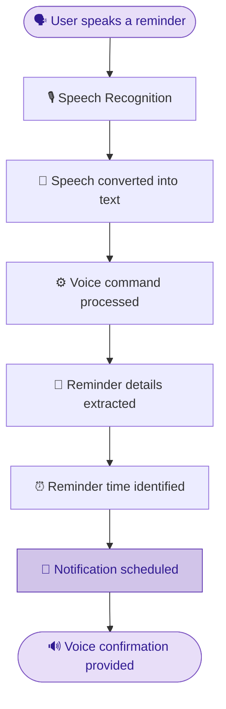
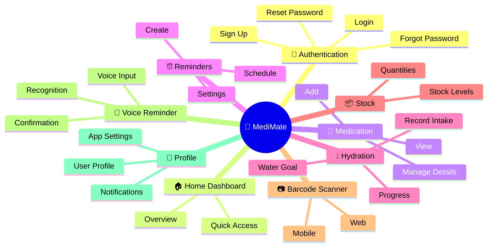
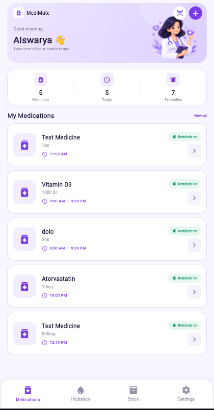
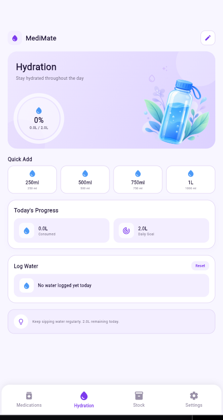
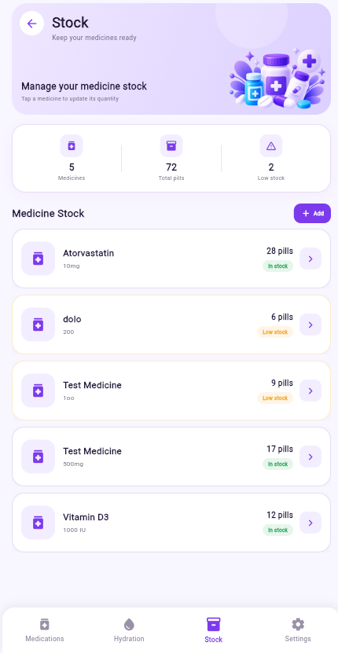
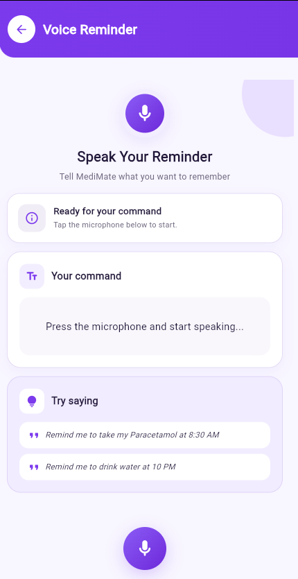

<div align="center">


# 💊 MediMate

### Your all-in-one medication companion

*Manage medicines • Get reminders • Stay hydrated • Track stock • Scan barcodes • Speak your reminders*

<br/>


<br/>

[✨ Features](#-features) •
[🎤 Voice Reminder](#-voice-reminder) •
[🏗️ Modules](#️-application-modules) •
[🚀 Getting Started](#-getting-started) •
[📸 Screenshots](#-screenshots) •
[🔮 Roadmap](#-future-enhancements)

</div>

---

## 📖 About the Project

**MediMate** is a Flutter-based medication management application that brings everything related to your daily medicine routine into **one simple, friendly app**.

Add medicines, set reminders, track your water intake, monitor medicine stock, scan barcodes, and even **create reminders just by speaking**.

> 🎓 **Academic Project** — Developed as an **MCA Mini Project** for the **Master of Computer Applications (MCA)** course.

### 🎯 Project Objective

To provide a simple digital solution for managing medication-related activities by combining **medication management, reminders, hydration tracking, stock monitoring, barcode scanning, and voice-based reminders** in a single application.

---

## ✨ Features

<table>
<tr>
<td width="50%" valign="top">

### 💊 Medication Management
- ➕ Add and manage medicines
- 📝 Store medicine name and dosage
- 🗓️ Manage medicine schedules
- 📋 View your full medication list
- 🗂️ Keep everything organized in one place

</td>
<td width="50%" valign="top">

### ⏰ Medication Reminders
- 🔔 Set reminders for medicines
- 📅 Schedule medication notifications
- ⚙️ Manage reminder settings
- ✅ Get notified at the scheduled time

</td>
</tr>
<tr>
<td width="50%" valign="top">

### 💧 Hydration Tracking
- 🎯 Set a daily water intake goal
- ⚡ Quick-add water intake options
- 📈 Track daily hydration progress
- 🥤 View current water intake

</td>
<td width="50%" valign="top">

### 📦 Medicine Stock
- 🔢 View medicine stock quantities
- 📊 Track available medicines
- ⚠️ Identify low-stock medicines
- 🧾 Stay on top of availability

</td>
</tr>
<tr>
<td width="50%" valign="top">

### 📷 Barcode Scanner
- 🔍 Scan medicine barcodes
- 📱 Supported on **mobile**
- 🌐 Supported on **web**
- 🏷️ Simplifies medicine identification

</td>
<td width="50%" valign="top">

### 🔐 User Authentication
- 📝 Registration
- 🔑 Login
- ❓ Forgot password
- 🔄 Reset password

</td>
</tr>
<tr>
<td width="50%" valign="top">

### 👤 Profile
- 🙋 View user profile
- 🛠️ Manage profile-related settings
- ⚙️ Access application settings

</td>
<td width="50%" valign="top">

### 🎨 User Interface
- 💜 Purple & lavender themed design
- 🧼 Clean and simple layout
- 📱 Mobile-friendly and responsive
- 🃏 Rounded cards and modern components
- 🖼️ Custom illustrations and icons

</td>
</tr>
</table>

---

## 🎤 Voice Reminder

MediMate lets you create medication reminders **using your voice**. Just say a command like:

> 🗣️ *"Remind me to take my Paracetamol at 8:30 AM"*

The app recognizes the spoken command, extracts the reminder details and time, and schedules a notification — then **speaks a confirmation back to you**.

| Capability | Description |
|:---|:---|
| 🎙️ **Speech-to-Text** | Converts your voice into text |
| 🧠 **Command Processing** | Understands the reminder command |
| ⏱️ **Time Extraction** | Picks the time out of your sentence |
| 🔔 **Auto Scheduling** | Schedules the notification automatically |
| 🔊 **Text-to-Speech** | Confirms the reminder out loud |

### 🔄 How It Works



### 💡 Example

| Step | Result |
|:---|:---|
| 🗣️ **User says** | *"Remind me to take my Paracetamol at 8:30 AM"* |
| 💊 **Reminder** | Take my Paracetamol |
| 🕗 **Time** | 8:30 AM |
| ✅ **Outcome** | Notification scheduled |

---

## 🛠️ Technologies Used

| Technology | Purpose |
|:---|:---|
|  | Application development |
|  | Programming language |
| 🎙️ **Speech-to-Text** | Voice recognition |
| 🔊 **Flutter TTS** | Text-to-speech |
| 🔔 **Local Notifications** | Medication reminders |
| 📷 **Barcode Scanner** | Medicine barcode scanning |
|  | Version control |
|  | Source code management |

---

## 🏗️ Application Modules



<details>
<summary><b>📋 Click to view module details</b></summary>

<br/>

| # | Module | What it includes |
|:-:|:---|:---|
| 1 | 🔐 **User Authentication** | Login, Sign Up, Forgot Password, Reset Password |
| 2 | 🏠 **Home Dashboard** | Overview of medication information, quick access to features |
| 3 | 💊 **Medication Management** | Add medication, view medications, manage details |
| 4 | ⏰ **Medication Reminders** | Create reminders, schedule notifications, manage settings |
| 5 | 💧 **Hydration Tracking** | Set water goal, record intake, track progress |
| 6 | 📦 **Medicine Stock** | View quantities, monitor stock levels |
| 7 | 📷 **Barcode Scanner** | Scan barcodes, mobile and web support |
| 8 | 🎤 **Voice Reminder** | Voice input, speech recognition, reminder creation, voice confirmation |
| 9 | 👤 **Profile & Settings** | User profile, app settings, notification settings |

</details>

---

## 📂 Project Structure

<details>
<summary><b>🌳 Click to expand the project tree</b></summary>

```text
medication/
│
├── assets/
│   └── images/
│       ├── home_doctor.png
│       ├── hydration_bottle.png
│       ├── notification_bell.png
│       └── stock_medicine.png
│
├── lib/
│   │
│   ├── screens/
│   │   ├── add_medication_screen.dart
│   │   ├── barcode_scanner_screen_mobile.dart
│   │   ├── barcode_scanner_screen_web.dart
│   │   ├── forgot_password_screen.dart
│   │   ├── home_screen.dart
│   │   ├── hydration_screen.dart
│   │   ├── login_screen.dart
│   │   ├── main_screen.dart
│   │   ├── medication_list_screen.dart
│   │   ├── medicine_stock_screen.dart
│   │   ├── profile_screen.dart
│   │   ├── reminder_settings_screen.dart
│   │   ├── reset_password_screen.dart
│   │   ├── signup_screen.dart
│   │   └── voice_reminder_page.dart
│   │
│   ├── services/
│   │   ├── notification_service.dart
│   │   ├── speech_recognition_service.dart
│   │   ├── speech_recognition_service_stub.dart
│   │   └── speech_recognition_service_web.dart
│   │
│   ├── widgets/
│   │   └── auth_widgets.dart
│   │
│   └── main.dart
│
├── pubspec.yaml
├── pubspec.lock
└── README.md
```

</details>

---

## 🚀 Getting Started

### ⚙️ Requirements

Make sure you have the following installed:

- ✅ [Flutter SDK](https://docs.flutter.dev/get-started/install)
- ✅ Dart SDK *(bundled with Flutter)*
- ✅ Android Studio **or** Visual Studio Code
- ✅ Android Emulator **or** a physical Android device
- ✅ [Git](https://git-scm.com/)

Verify your Flutter installation:

```bash
flutter doctor
```

### 📥 Installation

**1️⃣ Clone the repository**

```bash
git clone <YOUR_GITHUB_REPOSITORY_URL>
```

**2️⃣ Open the project**

```bash
cd medication
```

**3️⃣ Install dependencies**

```bash
flutter pub get
```

**4️⃣ Run the application**

```bash
flutter run
```

### 📱 Running on Android

Connect an Android device or start an emulator, then run:

```bash
flutter run
```

### 🌐 Running on Web

To run the app in Google Chrome:

```bash
flutter run -d chrome
```

---

## 🔐 Permissions

Some features need device permissions to work properly.

| Permission | Required For |
|:---:|:---|
| 🎤 **Microphone** | Voice reminder feature |
| 📷 **Camera** | Barcode scanning |
| 🔔 **Notifications** | Receiving medication reminders |

> ℹ️ The exact permission requirements may vary depending on the platform.

---

## 📸 Screenshots

> Add your app screenshots to a `screenshots/` folder and they will appear below.

<div align="center">

| 🏠 Home | 💊 Medications | 💧 Hydration |
|:---:|:---:|:---:|
|  |  |  |

| 📦 Medicine Stock | 🎤 Voice Reminder |
|:---:|:---:|
|  |  |

</div>

---

## 🔮 Future Enhancements

- [ ] 🔎 Medicine information lookup
- [ ] ☁️ Cloud-based data synchronization
- [ ] 🕓 Medication history
- [ ] 📄 Prescription management
- [ ] 🩺 Doctor information management
- [ ] 🔁 Multiple reminder schedules
- [ ] 🧠 Improved voice command processing
- [ ] 🛒 Medicine refill notifications
- [ ] 📊 Detailed medication reports
- [ ] 🖥️ Additional platform support

---

## 🎯 Purpose of the Project

MediMate was developed as an **MCA Mini Project** to demonstrate the use of **Flutter and Dart** in building a practical mobile application. It focuses on combining multiple medication-related features into a single app with a simple and user-friendly interface.

---

## 👩‍💻 Author

<div align="center">

**Aiswarya**

🎓 Master of Computer Applications (MCA)
📚 MCA Mini Project

</div>

---

## 📄 License

This project was developed for **academic purposes** as part of an MCA Mini Project.

---

<div align="center">

### 💜 Thank you for checking out MediMate!

If you like this project, please consider giving it a ⭐ on GitHub.

*Made with Flutter & 💜*

</div>